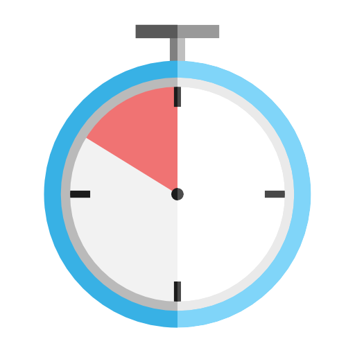
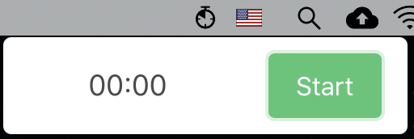
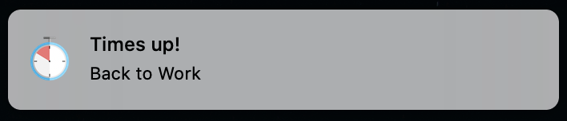
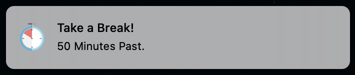

# Interval Timer
<p align="center">

</p>

Work timer to setup notification for a specific interval.

### Purpose

This Application was built to help control one's time working on a computer. It notifies the user to make sure to take a break from the screen every once in a while instead of staring into the screen for several hours. 

## Downloads

[MacOS .dmg Download](https://github.com/jerichoi224/interval-timer/raw/master/builds/Interval_Timer.dmg)


## Overview
State shown on menubar when application starts<br>


State shown on menubar when started (start button pressed)<br>


Notificaiton for finished work time<br>


Notificaiton for finished break time<br>


## Usage
```
npm install // install external library
npm run start // run in development mode.
```
## Update Log

- 05/28
    - Initial Commit
    - Initial Timer Working (Worktime[50], Breaktime[10])
    - App Icon Complete
- 05/29
    - Fixed App Icon showing on app notificaiton
    - Added Mac .dmg build
    - Changed to make app show on top of other full screen applicaitons
    - App doesn't show on Dock (MacOS)
-05/31
    - Added Rightclick menu
## To-Do
- Add comments in code
- Add Window/Linux Build
- Allow modification of work time and break time
