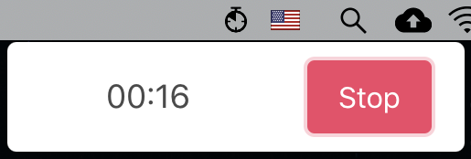

# Interval Timer
<p align="center">

</p>

Work timer to setup notification for a specific interval.

## Downloads

To do

## Overview

State shown on menubar when application starts<br>


State shown on menubar when started (start button pressed)<br>


Notificaiton for finished work time<br>


Notificaiton for finished break time<br>

## Features

Todo

## Use
```
npm install // install external library
npm run start // run in development mode.
```

## To-Do
- Allow modification of work time and break time
- Allow showing up on top of other fullscreen application on Mac
- Remove the App showing up from Dock
